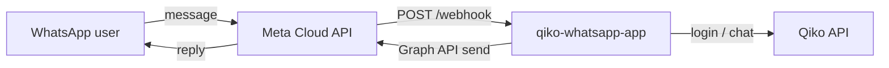

# Qikobot × WhatsApp — Complete integration guide

Yeh document **end-to-end** batata hai ke WhatsApp ko Qiko workers ke sath kaise connect karna hai. Slack app (`../slack-app/`) jaisa hi flow hai; farq sirf **Meta WhatsApp Cloud API** aur **text commands** ka hai.

---

## 1. Overview

| Layer | Technology |
|-------|------------|
| User channel | WhatsApp (personal or business chat with your number) |
| Messaging platform | [Meta WhatsApp Cloud API](https://developers.facebook.com/docs/whatsapp/cloud-api/) |
| This service | Node.js + Express (`whatsapp-app/`) |
| AI backend | Qiko API (`QIKO_API_BASE_URL`) — login, workers, chat |



### Slack vs WhatsApp (same product, different channel)

| Feature | Slack app | WhatsApp app |
|---------|-----------|----------------|
| Auth | Modal `/qiko-login` | Chat flow: `login` → email → password |
| List workers | `/qiko-workers` | `workers` |
| Pick worker | `/qiko-worker <name>` | `worker <name>` |
| Chat | `/qiko-chat …` or DM | Plain text message |
| Install | OAuth Add to Slack | Meta Business + phone number |
| Hosting | Render + Postgres (OAuth) | Render + file sessions (upgrade to Postgres optional) |

---

## 2. Prerequisites

1. **Meta Business account** — [business.facebook.com](https://business.facebook.com/)
2. **Meta Developer account** — [developers.facebook.com](https://developers.facebook.com/)
3. **Qiko account** — same email/password as [stage-app.qiko.ai](https://stage-app.qiko.ai)
4. **Public HTTPS URL** — Render, ngrok, etc. (Meta webhooks require HTTPS)
5. **Node.js 20+** and **pnpm** for local dev

---

## 3. Meta / WhatsApp setup (step by step)

### 3.1 Create a Meta app

1. Go to [developers.facebook.com/apps](https://developers.facebook.com/apps/) → **Create App**.
2. Type: **Business** (or “Other” → Business if shown).
3. App name e.g. `Qikobot WhatsApp`.
4. Connect to your Business Portfolio.

### 3.2 Add WhatsApp product

1. App Dashboard → **Add product** → **WhatsApp** → **Set up**.
2. Open **WhatsApp** → **API Setup** in the left menu.

You will see:

| Field | What it is | Maps to `.env` |
|-------|------------|----------------|
| **Phone number ID** | ID of the sending number | `META_PHONE_NUMBER_ID` |
| **WhatsApp Business Account ID** | WABA id (for billing/webhooks) | (optional reference) |
| **Temporary access token** | 24h test token | `META_ACCESS_TOKEN` (dev only) |

For **production**, create a **System User** in Business Settings with a **permanent token** that has `whatsapp_business_messaging` permission.

### 3.3 App Secret (webhook security)

1. **App settings** → **Basic** → copy **App secret** → `META_APP_SECRET`.
2. Used to verify `X-Hub-Signature-256` on incoming webhooks.

### 3.4 Verify token (you choose this)

Pick a long random string, e.g.:

```
META_VERIFY_TOKEN=my-random-verify-string-8f3k2j
```

Meta will send this back during webhook registration; your server must match it exactly.

### 3.5 Test phone numbers (development)

On **API Setup**:

1. Under **To**, add your personal WhatsApp number as a **test recipient**.
2. Only test recipients can message the **test** business number until the app is **Live** and number is approved.

### 3.6 Production phone number

1. **Phone numbers** → add or migrate a business number.
2. Complete Meta **business verification** if required.
3. Display name approval for “Qikobot” may take 1–3 days.

---

## 4. Deploy this service

### 4.1 Local

```bash
cd whatsapp-app
cp .env.example .env
pnpm install
pnpm dev
```

Default port: **3002**.

### 4.2 Public URL (local testing)

```bash
ngrok http 3002
```

Set in `.env`:

```
WHATSAPP_APP_URL=https://abcd-123.ngrok-free.app
```

### 4.3 Render (production)

See **[DEPLOY_RENDER.md](./DEPLOY_RENDER.md)**.

After deploy, your webhook URL is:

```
https://<your-service>.onrender.com/webhook
```

Open `https://<your-service>.onrender.com/` — status page shows Meta/Qiko config OK or missing.

---

## 5. Configure Meta webhook

1. Meta App → **WhatsApp** → **Configuration** (or **Webhooks**).
2. Click **Edit** on Webhook:

| Field | Value |
|-------|--------|
| **Callback URL** | `https://YOUR-DOMAIN/webhook` |
| **Verify token** | Same as `META_VERIFY_TOKEN` |

3. Click **Verify and save** — Meta sends `GET /webhook?hub.mode=subscribe&hub.verify_token=...&hub.challenge=...`  
   → Server responds with `hub.challenge` if token matches.

4. **Subscribe** to webhook field: **`messages`** (required).

Optional later: `message_template_status`, etc.

### 5.1 Webhook signature

Every `POST /webhook` includes `X-Hub-Signature-256: sha256=...`.  
This app verifies it with `META_APP_SECRET`. If secret is wrong, requests return **403**.

---

## 6. Environment variables (complete list)

```env
# Meta WhatsApp Cloud API
META_ACCESS_TOKEN=EAAx...
META_APP_SECRET=abc123...
META_VERIFY_TOKEN=your-random-verify-token
META_PHONE_NUMBER_ID=123456789012345
META_GRAPH_API_VERSION=v21.0

# Public base URL (Render sets RENDER_EXTERNAL_URL automatically)
WHATSAPP_APP_URL=https://qiko-whatsapp-app.onrender.com

PORT=3002

# Qiko (same as Slack app)
QIKO_API_BASE_URL=https://stage-backend.qiko.ai/api/avatar
QIKO_WEB_ORIGIN=https://stage-app.qiko.ai
QIKO_WEB_APP_URL=https://stage-app.qiko.ai
```

| Variable | Required | Description |
|----------|----------|-------------|
| `META_ACCESS_TOKEN` | Yes | Bearer token for Graph API `/{phone-number-id}/messages` |
| `META_APP_SECRET` | Yes | HMAC webhook verification |
| `META_VERIFY_TOKEN` | Yes | GET webhook handshake |
| `META_PHONE_NUMBER_ID` | Yes | Sending number ID from API Setup |
| `META_GRAPH_API_VERSION` | No | Default `v21.0` |
| `WHATSAPP_APP_URL` | Prod | Base URL; auto from `RENDER_EXTERNAL_URL` on Render |
| `QIKO_API_BASE_URL` | Yes | Must end with `/api/avatar` for stage |
| `QIKO_WEB_ORIGIN` | Yes | Origin header for WAF (match web app) |

---

## 7. End-user flow (WhatsApp chat)

1. User opens WhatsApp and messages your **business number**.
2. Sends **`help`** → command list.
3. Sends **`login`**:
   - Bot: “Reply with your Qiko email”
   - User: `you@company.com`
   - Bot: “Reply with password”
   - User: `********`
   - Bot: “Connected as …”
4. Sends **`workers`** → numbered list (names only, no UUIDs).
5. Sends **`worker Daniel Carter`** → active worker set.
6. Sends any question → reply from that worker via Qiko API.
7. **`logout`** → session cleared.

### Command reference

| User sends | Bot does |
|------------|----------|
| `help`, `hi`, `start` | Help text |
| `login` | Start email/password flow |
| `status` | Show linked Qiko account + active worker |
| `logout` | Clear session |
| `workers` | List ready workers |
| `worker <name>` | Set active worker (partial name match OK) |
| Anything else | Chat with active worker (auto-picks if only one ready worker) |

### Formatting

- API replies: `**bold**` → WhatsApp `*bold*`
- Long replies truncated at ~4000 chars (WhatsApp limit 4096)

---

## 8. Project structure

```
whatsapp-app/
├── README.md
├── WHATSAPP_INTEGRATION.md    ← this file
├── DEPLOY_RENDER.md
├── .env.example
├── package.json
├── render.yaml
├── tsconfig.json
└── src/
    ├── index.ts              # Express server, /health, /
    ├── config.ts             # Env + URLs
    ├── webhook.ts            # GET verify + POST messages
    ├── messageRouter.ts      # Commands + login state machine
    ├── whatsappClient.ts     # Send text via Graph API
    ├── whatsappFormat.ts     # Bold + truncate
    ├── qikoClient.ts         # Qiko login / agents / chat
    ├── qikoHttp.ts           # Headers for WAF
    ├── userSessions.ts       # Per WhatsApp user session
    ├── pendingLogin.ts       # Email/password steps
    ├── workerChat.ts         # Worker list / select / chat
    └── landing.ts            # Status HTML page
```

Data files (created at runtime):

- `data/whatsapp-sessions.json` — Qiko tokens + active worker
- `data/whatsapp-pending-login.json` — mid-login state

---

## 9. Testing checklist

- [ ] `GET /health` returns `{ ok: true, meta: true, qikoApi: true }`
- [ ] Meta webhook **Verify and save** succeeds
- [ ] Test number added in Meta API Setup
- [ ] Send `help` → receive command list
- [ ] `login` with valid Qiko credentials
- [ ] `workers` lists agents
- [ ] `worker <name>` sets active worker
- [ ] Plain question returns AI reply
- [ ] Invalid login shows error, can `login` again
- [ ] `logout` clears session

### Common errors

| Symptom | Fix |
|---------|-----|
| Webhook verify fails | `META_VERIFY_TOKEN` mismatch; URL must be HTTPS |
| 403 on POST webhook | Wrong `META_APP_SECRET` |
| No reply in WhatsApp | Check Render logs; token expired; recipient not in test list |
| Qiko login 403 | Backend WAF — allowlist Render IPs; check `QIKO_WEB_ORIGIN` |
| `(#131030) Recipient not in allowed list` | Add number as test recipient in Meta |

---

## 10. Security notes

1. **Never commit** `.env` or Meta tokens to git.
2. Always verify **webhook signatures** in production (`META_APP_SECRET`).
3. Passwords only used once for Qiko login; not stored (only bearer token in session file).
4. For production, store sessions in **Postgres** (copy pattern from `slack-app/src/postgresInstallationStore.ts`).
5. Rate limits: Meta and Qiko may throttle; add queue/retry later if needed.

---

## 11. Costs & limits (Meta)

- Conversation-based pricing — see [Meta WhatsApp pricing](https://developers.facebook.com/docs/whatsapp/pricing).
- **24-hour customer service window**: free-form replies allowed; outside window you need **approved message templates**.
- Test numbers: limited throughput.

---

## 12. Roadmap (optional enhancements)

| Feature | Notes |
|---------|--------|
| Postgres sessions | Survive Render redeploys |
| WhatsApp **Flows** | Richer login UI |
| **Interactive lists** | Pick worker from buttons |
| **Template messages** | Proactive outbound after 24h |
| Shared package | `@qiko/channel-core` for Slack + WhatsApp |
| Media messages | Download image/PDF → Qiko |

---

## 13. Quick links

| Resource | URL |
|----------|-----|
| Meta Cloud API docs | https://developers.facebook.com/docs/whatsapp/cloud-api/ |
| Webhooks | https://developers.facebook.com/docs/graph-api/webhooks/getting-started |
| Send messages | https://developers.facebook.com/docs/whatsapp/cloud-api/guides/send-messages |
| Qiko stage web | https://stage-app.qiko.ai |
| Slack app docs | `../slack-app/DEPLOY_RENDER.md` |

---

## 14. Support flow summary (Roman Urdu)

1. **Meta app** banao, WhatsApp product add karo.  
2. **Phone number ID** + **Access token** + **App secret** `.env` mein dalo.  
3. **Render** par deploy karo, URL copy karo.  
4. Meta mein **webhook** lagao: `.../webhook` + verify token.  
5. Apna number **test recipient** banao.  
6. WhatsApp par **login** → **workers** → **worker name** → sawal pucho.  

Slack app jahan **slash commands** hain, WhatsApp par **simple words** (`login`, `workers`, …) use hotay hain — logic same Qiko API par hai.
